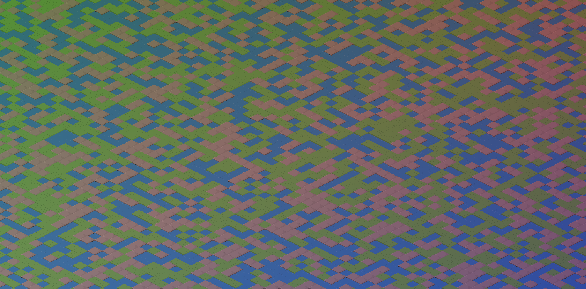
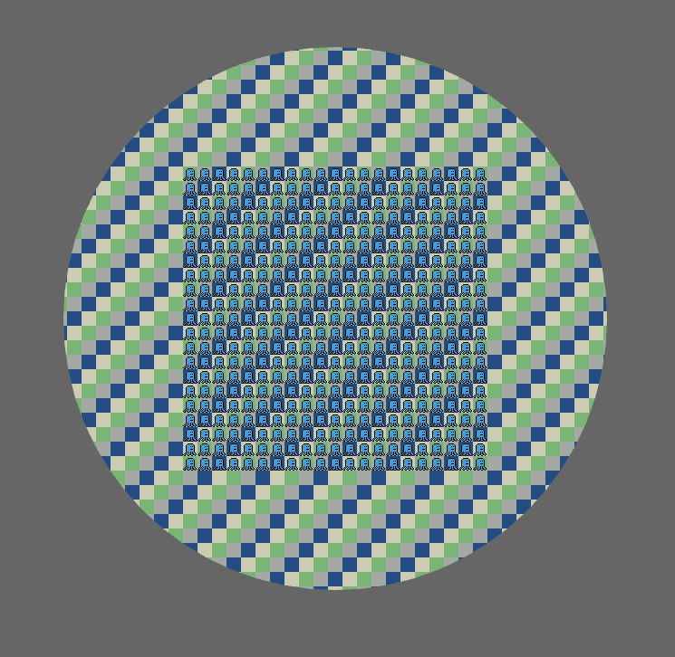

# Fast Tilemap for Bevy

[](https://crates.io/crates/bevy_fast_tilemap)
[](https://docs.rs/bevy_fast_tilemap/)

Lightning fast tilemaps for [`bevy`](https://bevyengine.org/).

## Features

- Very high rendering performance (hundreds of fps, largely independent of map size).
- Tilemaps can be very large or have many "layers".
- Rectangular and isometric (axonometric) tile maps.
- Coordinate conversion.
- Tiles can overlap either by "dominance" rule or by perspective.
  Perspective mode allows an orthographic camera like 3d look,
  that is, *tiles don't need to be flat but can be isometric "objects"* (see examples).
- Optional custom mesh for which the map serves as a texture.
- Color gradient for tinting the whole map.
- Custom shader code that can apply per-tile effects such as tinting or *animation*.

## Screenshots




Checkout  for more.

## How it works

The whole map is rendered as a single quad and a custom shader cares for rendering the
correct tiles at the correct position.

This works by using a storage buffer with tile indices and a tilemap atlas with the tiles.
With some clever sampling, tiles can overlap with correct perspective so a "tile" can actually be
any isometric object.
*Bevy-fast-tilemap* store the storage buffer in a special material which you can access and change
(see [examples/](examples/)).
The tilemap atlas should be provided by you (see [assets/](assets/) for atlas examples).

As of this writing, this should be (much) faster than most other bevy tilemap implementations out
there.

## Limitations

- Only tested on Windows, no WASM support
- Two kinds of "animation" are supported, you can
  - Update the tile indices regularly from a system (see [Animation Example](examples/animation.rs))
  - Inject some custom shader code that can animate a tile in whatever way you can express in WGSL.
- Currently no support for rotating or scaling the entity holding the map (it will not look like you'd expect).
  (You can of course still zoom/rotate the camera to achieve any such effect)

## Related work

If you dont require all of `bevy_fast_tilemap`s performance and are looking for an approach that
supports some more tile shapes and allows to treat each tile as a separate entity, take a look at
[bevy_ecs_tilemap](https://github.com/StarArawn/bevy_ecs_tilemap/) which (among others) inspired
this work.

## Examples

Check out the [examples/](examples/) folder to get an overview.
You can run the examples like this:

```bash
cargo run --example bench
cargo run --example animation
cargo run --example iso_perspective
cargo run --example custom_shader_code
cargo run --example updates
...
```

## Bevy Compatibility

|bevy|bevy_fast_tilemap|
|---|---|
|0.10|0.1.0|
|0.10|0.2.0|
|0.10|0.3.0|
|0.10|0.4.0|
|0.11|0.5.0|
|0.12|0.6.0|
|0.13|0.7.0|
|0.13|0.7.1|
|0.13|0.7.2|
