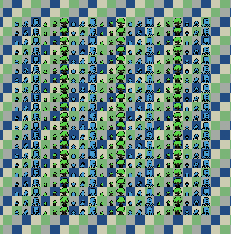

# Fast Tilemap for Bevy

[](https://crates.io/crates/bevy_fast_tilemap)
[](https://docs.rs/bevy_fast_tilemap/)

GPU-accelerated tilemap functionality for [`bevy`](https://bevyengine.org/).
Aims at rendering tilemaps with lightning speed by using just a single quad per map (layer)
and offloading the actual rendering to GPU.
This should be faster than most other bevy tilemap implementations as of this writing.

## Features

- Very high rendering performance (hundreds of fps, largely independent of map size)
- Tilemaps can be very large or have many "layers"
- Rectangular and isometric (axonometric) tile maps.
- Tile overlaps either by "dominance" rule or by perspective
- Optional custom mesh for which the map serves as a texture

## Screenshots





## How it works

The whole tilemap (-layer) is rendered as a single quad and a custom shader cares for rendering the
correct tiles at the correct position.

Thus each map layer works with two textures: One with integer data type, constructed and maintained
internally for storing for each tile position which tile index should be displayed there. And a
tile atlas that contains all the tiles which should be provided by you (see [assets/](assets/) for
atlas examples).

## Limitations

- Only tested on Windows, no WASM support
- No direct animation support, but due to the raw speed you can likely get away with just update the map data
  tiles.

## Related work

If you dont require all of `bevy_fast_tilemap`s performance and are looking for an approach that
supports some more tile shapes and allows to treat each tile as a separate entity, take a look at
[bevy_ecs_tilemap](https://github.com/StarArawn/bevy_ecs_tilemap/) which (among others) inspired
this work.

## Examples

Check out the [examples/](examples/) folder to get an overview.
You can run the examples like this:

```bash
cargo run --example updates
cargo run --example layers
cargo run --example iso
cargo run --example iso2
cargo run --example bench
...
```

## Bevy Compatibility

|bevy|bevy_fast_tilemap|
|---|---|
|0.10.1|0.1.0|
|0.10.1|0.2.0|
|0.10.1|0.3.0|
|0.10.1|0.4.0|
